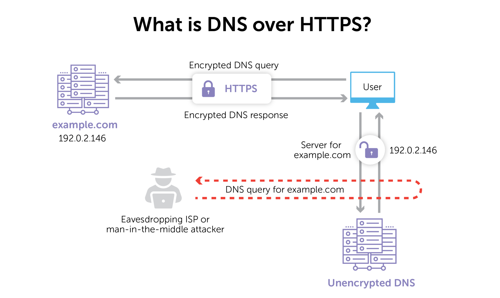
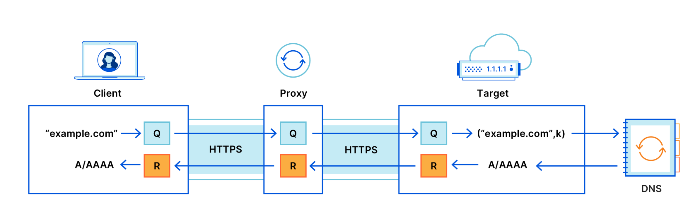

<!-- # DNS


###### <a id="1">[image credits]</a> https://www.cloudflare.com/en-gb/learning/dns/what-is-a-dns-server/

```
10:31:46.399184 IP 172.18.236.56.53553 > 8.8.8.8.53: 52359+ [1au] Type64? www.example.com. (44)
10:33:57.880054 IP 8.8.8.8.53 > 172.18.236.56.56370: 14137$ 1/0/1 A 93.184.216.34 (60)
```
 -->

<!-- # DOH Improvement


###### <a id="2">[image credits]</a> https://bluecatnetworks.com/blog/dns-over-https-what-why-who-cares/
 -->

# ODOH Improvement

<!--  -->
<!--  -->



###### <a id="4">[image credits]</a> credits https://blog.cloudflare.com/oblivious-dns/
###### <a id="4">Cloudfare ODoH Client in GO https://github.com/cloudflare/odoh-client-go.
--------------------------------------------------------------------------------------------------------------------------------------------

# Overview of ODoH

|  |       Step       |                 Actions                                                                                                                                               |
|------|---------------------|----------------------------------------------------------------------------------------------------------------------------------------------------------------|
| 1    | Fetch ODoH Configs  | A DNS Request is done to fetch HTTPS RR, which contains the odohconfig.                                                                                        |
| 2    | Parse ODoH Config   | The odohconfig can contain multiple odohconfigs. A valid odohconfig is used for subsequent ODoH Query.                                                         |
| 4    | Building ODOH Query | Construct a DNS Query message for the desired domain and RR type. This is Encrypted using the odohconfig of server and HPKE cryptography.                      |
| 5    | Sending ODoH Query  | Send the Encrypted payload over HTTPS to ODoH Targetchr. |
| 6    | Parse ODoH Response | The ODoH response is interpreted using the HPKE context from previous step.                                                                                    |


###### <a id="5">[note]</a> Cloudfare removed the odohconfig param from its DNS response and this is now achieved via rest call towards: ```https://odoh.cloudflare-dns.com/.well-known/odohconfigs```. DIG/ KDIG can show a byte info of the HTTPS. However it cannot show the actual contents as of now. DNS Python lib, SVCB RR Support is added. ODoH Config param is not explicit.

# Packet Analysis of ODOH

### 1. Input: 
A/ Desired DNS Answer for
<br />- which domain to look up.
<br />&nbsp;&nbsp;&nbsp;```www.cloudflare.com.```
<br />- which type of Resource Record for the domain.
<br />&nbsp;&nbsp;&nbsp;```type AAAA #28```

B/ odoh_config from,
<br />&nbsp;&nbsp;&nbsp;```https://odoh.cloudflare-dns.com/.well-known/odohconfigs```

C/ url to get odoh config.
<br />&nbsp;&nbsp;&nbsp;```odoh.cloudflare-dns.com```

D/ odoh target endpoint
<br />&nbsp;&nbsp;&nbsp;```https://odoh.cloudflare-dns.com/dns-query```

### 2. Fetch odoh configs
Currently the only odoh_config is from Cloudflare. Via POST request to<br />
```https://odoh.cloudflare-dns.com/.well-known/odohconfigs```

<br /> Response,<br />
```{200 OK 200 HTTP/2.0 2 0 map[Access-Control-Allow-Origin:[*] Cache-Control:[no-cache, no-store] Cf-Ray:[801465666ed1409f-BOM] Content-Length:[46] Date:[Mon, 04 Sep 2023 07:07:32 GMT] Last-Modified:[1693785600] Odoh-Server-Version:[2023.7.0] Server:[cloudflare]] {0xc000206000} 46 [] false false map[] 0xc000126200 0xc0000d4420}```

### 3. Structure of odoh configs is,
```
   struct {
      uint16 kem_id;
      uint16 kdf_id;
      uint16 aead_id;
      opaque public_key<1..2^16-1>;
   } ObliviousDoHConfigContents;

   struct {
      uint16 version;
      uint16 length;
      select (ObliviousDoHConfig.version) {
         case 0x0001: ObliviousDoHConfigContents contents;
      }
   } ObliviousDoHConfig;
```
The information received from the fetch request's content in byte representation:<br />
```[0 44 0 1 0 40 0 32 0 1 0 1 0 32 93 219 186 184 33 103 2 52 8 241 227 15 100 83 235 6 248 247 39 180 48 83 199 90 11 40 72 44 80 121 71 4]```

<br /><u>Note 1</u>. The helper func() UnmarshalObliviousDoHConfigContents is defined to parse the byte stream to capture the ObliviousDoHConfigContents.
<br /><u>Note 2</u>. The ObliviousDoHConfig can have multiple ObliviousDoHConfigContents. In this example there is only one structure of ObliviousDoHConfigContents.

byte structure when parsed (in-order):
<br />&nbsp;  2B - [0 44] is the length of the message stream of odoh_config.
<br />&nbsp;  2B - [0  &nbsp; 1] is the version of odoh_config.
<br />&nbsp;  2B - [0 40] is the length of the structure ObliviousDoHConfigContents from the odoh rfc.
<br />&nbsp; 2B - [0 32] is the enum value of kem_id corresponding to the KEM from algorigthm the hpke rfc.
<br />&nbsp; 2B - [0 &nbsp; 1] is the enum value of kdf_id corresponding to the KDF from algorigthm the hpke rfc.
<br />&nbsp; 2B - [0 &nbsp; 1] is the enum value of aead_id corresponding to the AEAD algorigthm from the hpke rfc.
<br />&nbsp; 2B - [0 32] is the length of the public_key in ObliviousDoHConfigContents.
<br />32B - [...]is the public_key in ObliviousDoHConfigContents.


### 4. Construct the ObliviousDoHConfig as,
```
   struct {
      enum kem_id  = 32 // DHKEM(X25519,HKDF-SHA256);
      enum kdf_id  =  1 // HKDF-SHA256;
      enum aead_id =  1 // AES-128-GCM;
      byte public_key = [93 219 186 184 33 103 2 52 8 241 227 15 100 83 235 6 248 247 39 180 48 83 199 90 11 40 72 44 80 121 71 4];
   }
```

### 5. Create a DNS question of the domain and type of RR to look for. 

;;;;;;;;;;;;;;;;;;;;;;;;;;;;;;;;;;;;;;;;;;;;;;;;;;;;;;;;;;;;;;
;; opcode: QUERY, status: NOERROR, id: 62411
;; flags: rd; QUERY: 1, ANSWER: 0, AUTHORITY: 0, ADDITIONAL: 0

;; QUESTION SECTION:
;www.cloudflare.com. IN  AAAA
;;;;;;;;;;;;;;;;;;;;;;;;;;;;;;;;;;;;;;;;;;;;;;;;;;;;;;;;;;;;;;;


5. Transform DNS question to byte stream.
byte representation:
[243 203 1 0 0 1 0 0 0 0 0 0 3 119 119 119 10 99 108 111 117 100 102 108 97 114 101 3 99 111 109 0 0 28 0 1]


6. Add padding,
      - here padding is 0B.
byte representation:
[[243 203 1 0 0 1 0 0 0 0 0 0 3 119 119 119 10 99 108 111 117 100 102 108 97 114 101 3 99 111 109 0 0 28 0 1][]]


7. Encode this DNS Question
- by adding byte information to capture length of the message.
- Using this the parser will know how many bytes of message and how many bytes of padding exists.
- Length is captured in 2B.

byte representation:
the DNS Message will be [0 36 243 203 1 0 0 1 0 0 0 0 0 0 3 119 119 119 10 99 108 111 117 100 102 108 97 114 101 3 99 111 109 0 0 28 0 1]
The padding Message will be [0 0]

The encoded_message, [[0 36 243 203 1 0 0 1 0 0 0 0 0 0 3 119 119 119 10 99 108 111 117 100 102 108 97 114 101 3 99 111 109 0 0 28 0 1] [0 0]]

8. ephemeral keys
- short lived keys, of small size.
- these keys are used as part of the Asymmetric cryptography.
- input ikm, Input Keying Material OR Salt. Random Generated.
- DeriveKeyPair(ikm) with algo is X25519() with label "odoh query"

- secret is depends on the hpke_MODE SetupBaseS() here it is, Encap(rand, pkR)
- ExporterSecret is a derivative of LabeledExpand() on secret with label "exp"
- context_secret is a derivative of LabeledExpand() on ExporterSecret "odoh response"

byte representation:

pkE [185 46 17 18 250 114 197 242 103 162 108 19 198 60 27 109 217 188 162 172 51 238 166 178 244 219 225 2 92 42 229 74]
skE [212 46 236 37 95 134 158 162 50 42 195 28 62 55 54 1 43 144 253 36 47 149 13 43 77 127 239 70 152 51 56 224]

secret [209 55 114 215 25 255 30 91 74 149 36 178 169 23 10 38 73 243 82 29 90 213 83 55 192 227 49 187 43 94 146 167]
ExporterSecret [146 254 159 8 154 183 38 156 157 197 4 239 80 120 205 70 97 153 146 81 193 2 189 69 170 37 170 32 18 124 224 89]
context_secret is [8 96 214 85 206 203 91 140 60 57 56 240 109 106 63 99]
enc is [185 46 17 18 250 114 197 242 103 162 108 19 198 60 27 109 217 188 162 172 51 238 166 178 244 219 225 2 92 42 229 74]

9. KeyID()

-computed by Extract(Expand(odoh_config, ODOH_LABEL_KEY_ID))

byte representation:
keyID is [174 61 228 158 138 72 229 161 140 196 100 87 24 161 73 118 245 106 213 72 111 199 184 149 49 197 51 65 166 145 14 137]

10. AAD
- AAD, Associated Data. Commonly used to provide context, metadata, or other information that needs to be associated with the encrypted message.
- Calculated as,
aad = QueryType + len(keyID)) + keyID

byte representation:
aad, [1 0 32 174 61 228 158 138 72 229 161 140 196 100 87 24 161 73 118 245 106 213 72 111 199 184 149 49 197 51 65 166 145 14 137]

11. Cipher Text [ct]
ct = sender.seal(encoded_message, aad)

byte representation:
[236 61 78 158 127 234 51 100 237 45 186 211 239 138 234 59 248 156 8 37 203 190 230 29 37 206 226 245 
14 130 241 244 107 157 191 136 207 73 57 168 132 70 8 177 30 149 252 83 120 220 217 227 18 241 44 146]
12. odns_message
-The encrypted Oblivious DNS Question as message to odoh target.
-This structure is packed as,

ObliviousDNSMessage(
	KeyID,
	MessageType,
	encrypted_message
}

MessageType is an Identifier to distinguish, if the ObliviousDNSMessage is a Response or a Question. This is packed in 1B.
encrypted_message is [enc + ct]
byte representation:
ObliviousDNSMessage {
    1,
    [174 61 228 158 138 72 229 161 140 196 100 87 24 161 73 118 245 106 213 72 111 199 184 149 49 197 51 65 166 145 14 137],
    [185 46 17 18 250 114 197 242 103 162 108 19 198 60 27 109 217 188 162 172 51 238 166 178 244 219 225 2 92 
        42 229 74 236 61 78 158 127 234 51 100 237 45 186 211 239 138 234 59 248 156 8 37 203 190 230 29 37 206 226 
        245 14 130 241 244 107 157 191 136 207 73 57 168 132 70 8 177 30 149 252 83 120 220 217 227 18 241 44 146]
}


13. query_context

query_context = QueryContext(
	secret : context_secret,
	suite: suite (kem, kdf, aead),
	query : encoded_DNSmessage,
	publicKey : target_key
)


14. Prepare HTTP Request

odoh_endpoint="https://odoh.cloudflare-dns.com/dns-query"

 headers = {
'accept': OBLIVIOUS_DOH_CONTENT_TYPE,
'content-type': OBLIVIOUS_DOH_CONTENT_TYPE
}


15. serialize ObliviousDNSMessage

ObliviousDNSMessage (
	KeyID,
	MessageType,
	encrypted_message
}

 serialized_odns_message : [messageType + [length(KeyID) + KeyID] + [length(EncryptedMessage) + EncryptedMessage]]


16. ODOH Request

with headers and serialized_odns_message


17. ODOH Response

byte representation:
[2 [141 228 110 38 172 167 92 201 39 250 141 186 205 65 63 250] [162 111 25 142 99 129 126
41 209 88 214 193 148 115 43 167 149 244 222 173 198 35 215 11 11 186 102 54 188 126 30 232
147 29 55 10 35 121 136 175 25 183 71 158 11 91 137 58 169 243 80 218 219 247 28 210 185 95
116 47 75 158 4 57 90 71 162 94 215 70 183 45 6 99 186 38 103 102 205 26 100 96 47 134 35 224 
67 72 121 116 171 220 142 102 112 220 106 54 40 199 8 196 47 16 173 121 55 93 234 122 157 20]]

  1B is message_type
  16B is key_id
[...] is encrypted_message = byte_response[21:]


18. HPKE computations 

byte representation:
encoded_response_nonce :[len(KeyID) + KeyID]
                       : [0 16 141 228 110 38 172 167 92 201 39 250 141 186 205 65 63 250]

salt :bytes(query_context.query) + encoded_response_nonce
	 :encoded_message + encoded_response_nonce
     : [[0 36 243 203 1 0 0 1 0 0 0 0 0 0 3 119 119 119 10 99 108 111 117 100 102 108 97 114
        101 3 99 111 109 0 0 28 0 1 0 0] [0 16 141 228 110 38 172 167 92 201 39 250 141 186 205 65 63 250]]

aad :[ResponseType + encoded_response_nonce]
    : [2 0 16 141 228 110 38 172 167 92 201 39 250 141 186 205 65 63 250]

prk : Extract(salt, query_context.secret)
    : Extract(salt, context_secret)
    : [19 127 8 208 15 219 144 12 23 238 67 50 148 200 213 190 244 85 236 207 199 176 68 192 130 220 217 228 207 97 72 97]

key : expand(prk, ODOH_LABEL_KEY)
    : [132 116 63 188 106 121 197 82 70 117 69 227 102 227 27 45]

nonce : expand(prk, ODOH_LABEL_NONCE)
      : [162 212 227 73 79 75 145 219 244 247 157 76]

plaintext : decrypt(nonce, EncryptedMessage, aad)

pt : [0 92 243 203 129 128 0 1 0 2 0 0 0 0 3 119 119 119 10 99 108 111 117 100 102 108 97 114
     101 3 99 111 109 0 0 28 0 1 192 12 0 28 0 1 0 0 0 214 0 16 38 6 71 0 0 0 0 0 0 0 0 0 104
     16 123 96 192 12 0 28 0 1 0 0 0 214 0 16 38 6 71 0 0 0 0 0 0 0 0 0 104 16 124 96 0 0]

 2B is length of message
92B is message
 0B is length of padding
 0B is padding


19. DNS Answer

 >> ODoH Resolution

Header:
ID: 33691
Opcode: Opcode.QUERY
RCODE: Rcode.NOERROR

Questions:
Name: www.cloudflare.com.
Qtype: 28
Qclass: 1

Answers:
Name: www.cloudflare.com.
Type: 28
Class: 1
TTL: 13
Data: www.cloudflare.com. 13 IN AAAA 2606:4700::6810:7c60


